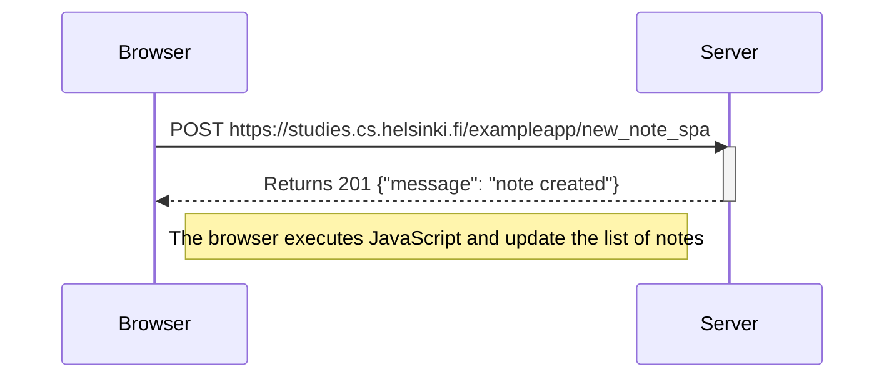

```mermaid
sequenceDiagram
    participant Browser
    participant Server

    Browser->>Server: POST https://studies.cs.helsinki.fi/exampleapp/new_note_spa
    activate Server
    Server-->>Browser: Returns 201 {"message": "note created"}
    deactivate Server

    Note right of Browser: The browser executes JavaScript and update the list of notes
```
