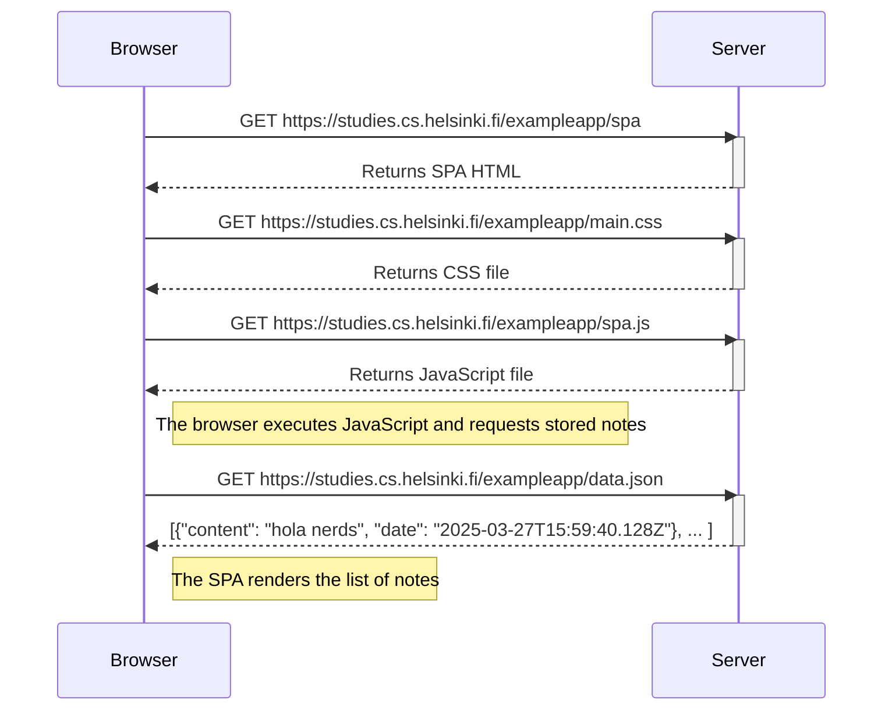

```mermaid
sequenceDiagram
    participant Browser
    participant Server

    Browser->>Server: GET https://studies.cs.helsinki.fi/exampleapp/spa
    activate Server
    Server-->>Browser: Returns SPA HTML
    deactivate Server

    Browser->>Server: GET https://studies.cs.helsinki.fi/exampleapp/main.css
    activate Server
    Server-->>Browser: Returns CSS file
    deactivate Server

    Browser->>Server: GET https://studies.cs.helsinki.fi/exampleapp/spa.js
    activate Server
    Server-->>Browser: Returns JavaScript file
    deactivate Server

    Note right of Browser: The browser executes JavaScript and requests stored notes

    Browser->>Server: GET https://studies.cs.helsinki.fi/exampleapp/data.json
    activate Server
    Server-->>Browser:  [{"content": "hola nerds", "date": "2025-03-27T15:59:40.128Z"}, ... ]
    deactivate Server

    Note right of Browser: The SPA renders the list of notes
```
